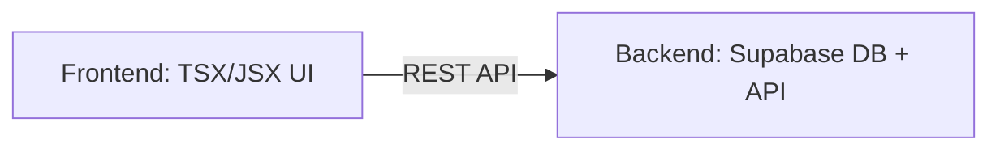

Link to website: https://bmlw.vercel.app/


# CSC468 - Project Deliverable 1


## Proposal

This project is an add-on to a landscaping website that I am currently developing. One feature I will be adding to the website is having a calender where the user can select a timeslot where someone would come give them an estimate. Based on this interaction, I plan on using Node images.


## Vision



# CSC468 - Project Deliverable 2

## Build Process

Dockerfile:
```dockerfile
FROM node:20-alpine
WORKDIR /app
COPY package*.json ./
RUN npm install
COPY . .
EXPOSE 3000
CMD ["npm", "run", "dev"]
```


# CSC468 - Project Deliverable 1


## Proposal

This project is an add-on to a landscaping website that I am currently developing. One feature I will be adding to the website is having a calender where the user can select a timeslot where someone would come give them an estimate. Based on this interaction, I plan on using Node images.


## Vision


# CSC468 - Project Deliverable 2

## Build Process

Dockerfile:
```dockerfile
FROM node:20-alpine
WORKDIR /app
COPY package*.json ./
RUN npm install
COPY . .
EXPOSE 3000
CMD ["npm", "run", "dev"]
```

The base image is Node 20 Apline. Node 20 is required for Next.js 16+ and Supabase libraries. I chose Alpine because it is lightweight and it reduces build time.

All commands after "WORKDIR /app" will run in /app. 

"COPY package*.json ./" copies package.json and package-lock.json first. This speeds up rebuilds.

"RUN npm install" Installs all dependencies.

"COPY . ." This copies all the source files after everything is installed.

"EXPOSE 3000" This opens a port so that it is accessible via local machine.

"CMD ["npm", "run", "dev"]" This is one way to quickly start up the website on a local machine.

## Networking

There are two containers being created: app and db. The app container runs the Next.js website and db runs the Supabase (or Postgres) database. 

This project utilizes a bridge network for the containers to communicate. This is done by using service names (app and db). They are locally available on different ports: app - 3000 and db - 5432. 


# CSC468 - Project Deliverable 3 - Final Documentation

Video of Demonstration: 

## Requirements

- Docker version 29.2.1+
- Docker Compose version v5.1.0+
- Next.js 11.7.0+
- PostgreSQL 15+
- Ports 3000 and 5432 must be accesible

## Overview of Built Containers

This project consists of two services: app and db.

 - app represents the Next.js application (runs on port 3000)
 
 - db represents the PostgreSQL databse (runs on port 5432)

These services communicate over a Docker network using service names (see above under Networking).

## How to Build and Deploy Using CloudLab and Docker

1.) In CloudLab, locate "Experiments" at the top and select "Create Experiment Profile"

2.) Create a name and select "git repo" for "Source code" (For the Project section, cloud-edu is selected)

3.) Paste the URL from this repo into the input: "https://github.com/JakeJohnson5252/bmw.git"

4.) Create the experiment and Instantiate it

5.) After instantiation, "ssh" into the experiment using a terminal (I used the Docker Desktop terminal in video)

6.) Clone the repo and get into the right directory and make sure docker+docker-compose is installed: 
```
git clone https://github.com/JakeJohnson5252/bmw.git
cd bmw
sudo apt install docker
sudo apt install docker-compose
```

7.) Now we can build and start the two containers
```
sudo docker-compose up -d --build
```

8.) To see if containers are running type
```
sudo docker ps
```
There should be two containers running: bmw_app_1 and bmw_db_1

9.) To test the connection (Crt-C to stop pinging and exit to exit the container)
```
sudo docker exec -it bmw_app_1 sh
ping db
``` 
10.) To open the bmw_app_1 container in a browser
```
hostname -I
```
Use the first IP address in the output to insert into the link and type this into your browser: "http://useoutput:3000"
