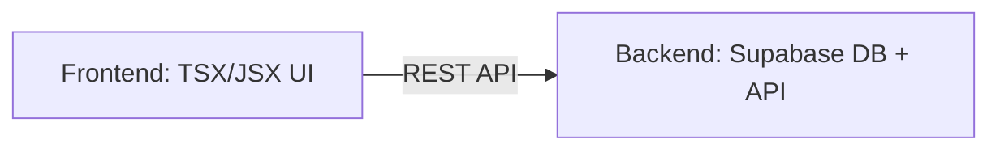

Link to website: https://bmlw.vercel.app/


# CSC468 - Project Deliverable 1


## Proposal

This project is an add-on to a landscaping website that I am currently developing. One feature I will be adding to the website is having a calender where the user can select a timeslot where someone would come give them an estimate. Based on this interaction, I plan on using Node images.


## Vision



# CSC468 - Project Deliverable 2

## Build Process

Dockerfile:
```dockerfile
FROM node:20-alpine
WORKDIR /app
COPY package*.json ./
RUN npm install
COPY . .
EXPOSE 3000
CMD ["npm", "run", "dev"]
```

##### The base image is Node 20 Apline. Node 20 is required for Next.js 16+ and Supabase libraries. I chose Alpine because it is lightweight and it reduces build time.
---
#### All commands after "WORKDIR /app" will run in /app. 
---
"COPY package*.json ./" copies package.json and package-lock.json first. This speeds up rebuilds.
---
"RUN npm install" Installs all dependencies.
---
"COPY . ." This copies all the source files after everything is installed.
---
"EXPOSE 3000" This opens a port so that it is accessible via local machine.
---
"CMD ["npm", "run", "dev"]" This is one way to quickly start up the website on a local machine.
---
## Networking

There are two containers being created: app and db. The app container runs the Next.js website and db runs the Supabase (or Postgres) database. 

This project utilizes a bridge network for the containers to communicate. This is done by using service names (app and db). They are accesible on different ports: app - 3000 and db - 5432. 
